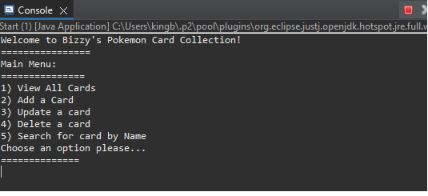
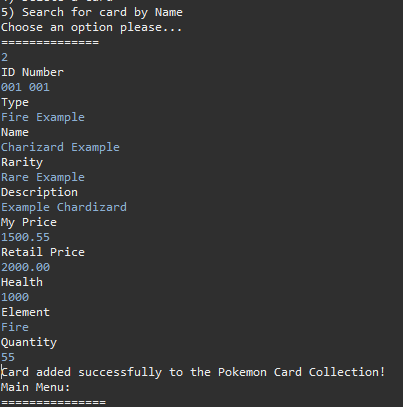
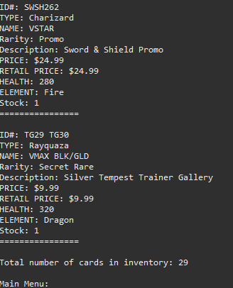
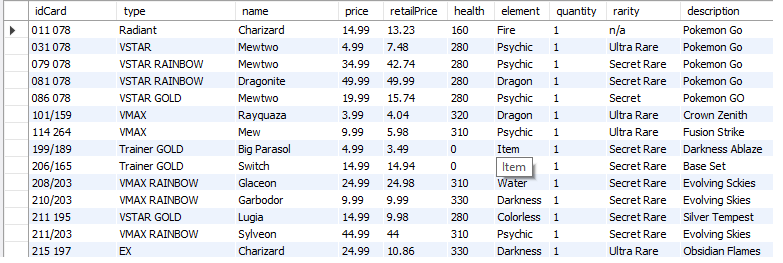

<h2 align="center">Pokemon Card Collection Inventory</h2>

  
  

  A simple <b>Pokemon Card Inventory System</b> built with Java, JDBC, and MySQL. Keep track of your Pokemon cards, their prices, and filter by details like, rarity, type, or element.

---

## Features
- **View All Cards** - display the full card list with details
- **Add a Card** - insert new cards into the collection's list
- **Update a Card** - change/edit existing cards and anything in their details
- **Delete a Card** - remove cards by index number from the list
- **Search Card by Name** - quicly search through the list to find a specific card and its details
- **Card count Displayed** - count the cards and show total

  ---

## Tech Stack
- Java (OOP, JDBC)
- MySQL (relational database)
- Maven (project management & depdencies)

---

## Screenshots of UI and MySQL table

  <b>Main Menu</b> 
  

  <b>Adding a Card</b> 
  

  <b>Display/View All Cards</b> 
  

  <b>MySQL Table</b> 
  

---

<h3>Developed by</h3> 
Bruce Brown

